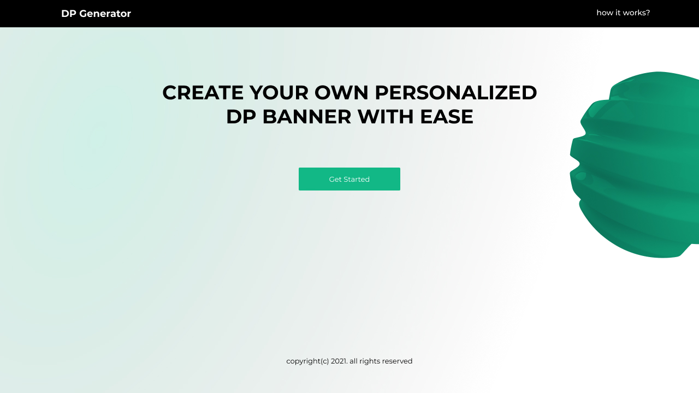

<!-- ABOUT THE PROJECT -->
## About The Project

This is a rest api for generating customized DP's for events. Just like [getdp.co](getdp.co).

### Technologies used

* [Django rest framework](django-rest-framework.org)
* [Pillow](https://pillow.readthedocs.io/en/stable/)
* [Cloudinary](https://cloudinary.com/)

## [Endpoints](https://dp-generator-api.herokuapp.com/)

|ROUTE                |DESCRIPTION                    |
|---------------------|-------------------------------|
|post/                |This creates the campaign.     |
|view/post/           |This returns the json of data created by a user on a browser. All the post created on a browser are returned as users are identified by session
|                     |id's. |                 
|modify/{id}/         |This works with two http verbs, 'put' for modification, 'delete' to delete a post. An authorization measure was put as we are working with       |                     |anonymous users such that one can only deleted posts created in a particular browser otherwise there is an error.|
|{slug}/              | This is the custom url created by campaign creators to share with users to create their custom dp.|
|make/dp/{slug}       | This is where the magic happens. This creates the custom dp. There is support for a circular , rounded rectangle or rectangular selected area.|

## Projects built with this rest API

* DP Generator
  [Live site](https://dp-generator.vercel.app/)| [Github link](https://github.com/eniolajayi/dp-generator)
  
  Presentation embedded in image below:
  

## Contributing

1. Fork the Project
2. Create your Feature Branch (`git checkout -b feature/AmazingFeature`)
3. Commit your Changes (`git commit -m 'Add some AmazingFeature'`)
4. Push to the Branch (`git push origin feature/AmazingFeature`)
5. Open a Pull Request

Ensure to contact me on [Linkedin](https://www.linkedin.com/in/maureen-ononiwu-49b3b212a/)

